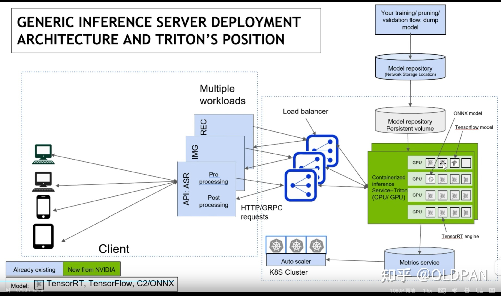
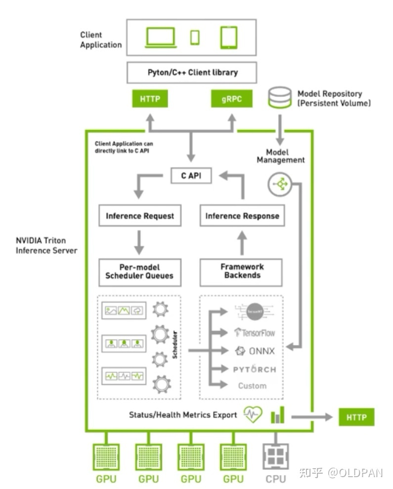

Triton

可以大概知道triton的一些功能和特点：

+ 支持HTTP/GRPC
+ 支持多backend，TensorRT、libtorch、onnx、paddle、tvm啥的都支持，也可以自己custom，所以理论上所有backend都可以支持
+ 单GPU、多GPU都可以支持，CPU也支持
+ 模型可以在CPU层面并行执行
+ 模型管理比如热加载、模型版本切换、动态batch，类似于之前的tensorflow server
+ 开源自定义后端接口

模型配置：
所需的模型配置：
+ Triton推理服务器要求在模型配置中填写一些最低要求参数。这些所需参数基本上与模型的结构有关。对于TensorFlow、**ONNX**和TensorRT模型，用户可以依靠Triton来自动生成最低要求的模型配置。
    
    + 最大batchsize
    + 输入输出Tensor
    + 模型实例数
    + 模型优化
    + [调度和批处理](https://github.com/triton-inference-server/server/blob/main/docs/README.md#scheduling-and-batching)：Triton支持对单个推理请求进行批处理，以提高计算资源的利用率。这一点极为重要，因为单个请求通常不会使GPU资源饱和，因此不能充分利用GPU提供的并行性。
        + 默认策略： non_batch
        + dynamic_batch
            + 配置动态批处理
            + 按请求顺序
            + 优先级
            + 队列方式
            + 随机处理
        + 序列批处理
        

